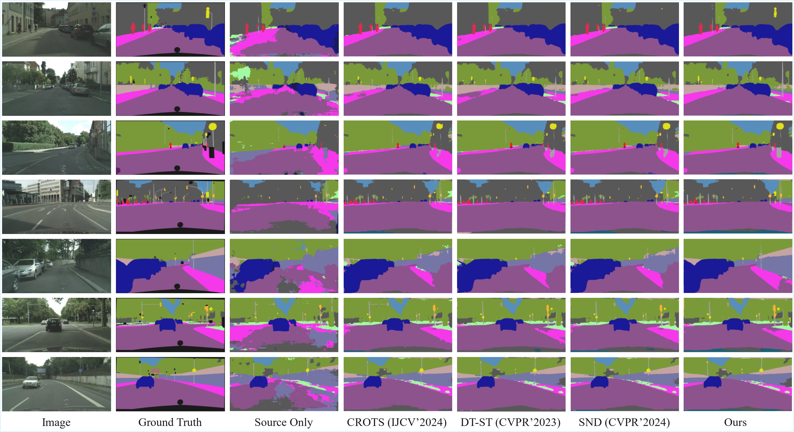
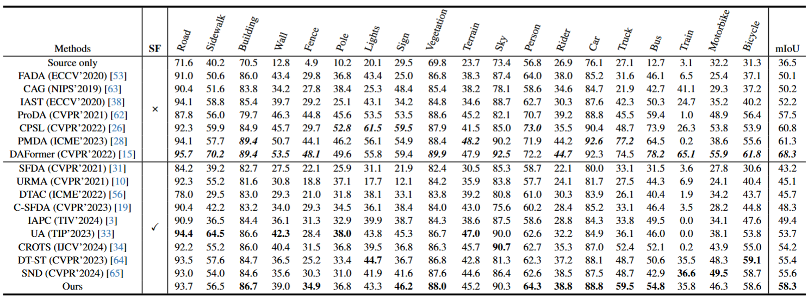
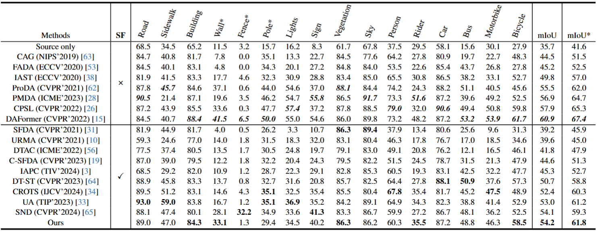
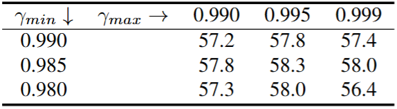
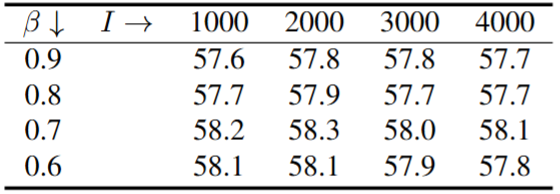
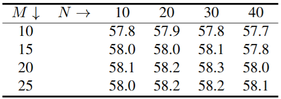
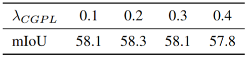

<div align="center">

# Prototypical Self-Training with Progress-Aware Update for Source-Free Domain Adaptation in Semantic Segmentation

[](http://2026.ieeeicassp.org/)
[](https://drive.google.com/drive/folders/1CYooo-uTGEHzviT2smwlhHaXQCNimy2M?usp=sharing)

</div>

---

## 📖 Abstract

The remaining core code will be released once our paper is accepted. To demonstrate the authenticity of our results, we provide part of the core code, training logs, and the trained segmentation model.

## 📂 Downloads & Resources

We provide the training logs, trained models, and prediction results for verification.

| Resource | Link | Description |
| :--- | :---: | :--- |
| **Training Logs & Models** | [Download](https://drive.google.com/drive/folders/1CYooo-uTGEHzviT2smwlhHaXQCNimy2M?usp=sharing) | Contains `.log` files and checkpoints |
| **Test Results** | [Download](https://drive.google.com/drive/folders/1CYooo-uTGEHzviT2smwlhHaXQCNimy2M?usp=sharing) | Predicted segmentation masks |
| **Cityscapes Dataset** | [Website](https://www.cityscapes-dataset.com/) | Official dataset website |

## 🚀 Getting Started

### Testing
You can try testing the trained model on the validation set using the following command:

```bash
python test.py -cfg configs/deeplabv2_r101_dtst.yaml resume results/model_20000.pth
```
## 🎨 Visualization Results

### Qualitative results on GTA5 → Cityscapes
<div align="center">
  
</div>

## 📊 Comparison to State-of-the-Art

> **Note:** 'SF' represents whether the method is in a source-free setting. The **highest results** in UDA methods are in bold italics. The **best results** in SFDA methods are in bold.

### 1. GTA5 → Cityscapes
<div align="center">
  
</div>

### 2. SYNTHIA → Cityscapes
<div align="center">
  
</div>

## 📉 Ablation Study

Here we provide the sensitivity analysis of various hyperparameters used in our method.

| Momentum Bounds ($\gamma$) | Prototype Update ($\beta, I$) |
| :---: | :---: |
|  |  |
| **(a) Sensitivity of $\gamma_{min}$ and $\gamma_{max}$** | **(b) Sensitivity of momentum $\beta$ and interval $I$** |

| Sampling Parameters ($M, N\%$) | Hyperparameter $\lambda_{CGPL}$ |
| :---: | :---: |
|  |  |
| **(c) Sensitivity of sampled instances $M$ and top $N\%$** | **(d) Sensitivity of $\lambda_{CGPL}$** |

## 🔗 References

We would like to thank the following paper for providing code that was helpful to our work:

```bibtex
@inproceedings{zhao2023towards,
  title={Towards better stability and adaptability: Improve online self-training for model adaptation in semantic segmentation},
  author={Zhao, Dong and Wang, Shuang and Zang, Qi and Quan, Dou and Ye, Xiutiao and Jiao, Licheng},
  booktitle={Proceedings of the IEEE/CVF conference on computer vision and pattern recognition},
  pages={11733--11743},
  year={2023}
}
