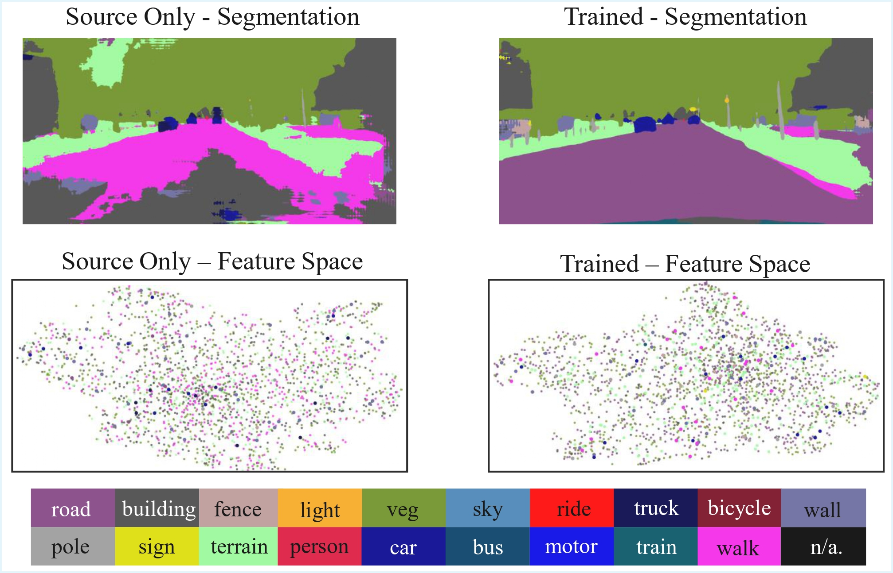

# [Prototypical Self-Training with Progress-Aware Update for Source-Free Domain Adaptation in Semantic Segmentation]

The remaining core code will be released once our paper is accepted. To demonstrate the authenticity of our results, we provide part of the core code, training logs, and the trained segmentation model.

## Training logs and Trained models

There are available at [here](https://drive.google.com/drive/folders/1CYooo-uTGEHzviT2smwlhHaXQCNimy2M?usp=sharing).

You can try testing the trained model on the validation set.
```bash
python test.py -cfg configs/deeplabv2_r101_dtst.yaml resume results/model_20000.pth
```
For convenience, we also provide the [test result](https://drive.google.com/drive/folders/1CYooo-uTGEHzviT2smwlhHaXQCNimy2M?usp=sharing).

## Dataset
Download The [Cityscapes Dataset](https://www.cityscapes-dataset.com/).


## Visualization results


###
To demonstrate that our consistency-guided prototypical learning can guide features to form more compact and well-separated clusters, we use UMAP to visualize the pixel feature distributions for the source-only model (left) and our method (right).


##
We would like to thank the following paper for providing code that was helpful to our work.
```bash
@inproceedings{zhao2023towards,
  title={Towards better stability and adaptability: Improve online self-training for model adaptation in semantic segmentation},
  author={Zhao, Dong and Wang, Shuang and Zang, Qi and Quan, Dou and Ye, Xiutiao and Jiao, Licheng},
  booktitle={Proceedings of the IEEE/CVF conference on computer vision and pattern recognition},
  pages={11733--11743},
  year={2023}
}    
```
